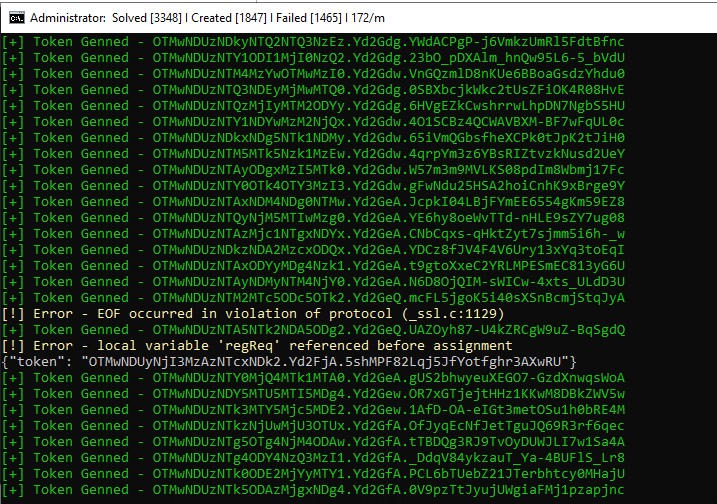

# Token-Gen-AI: Advanced Captcha Solving with Artificial Intelligence

Unlock the potential of cutting-edge AI technology for captcha solving with Token-Gen-AI.

## Installation Instructions

### Method 1: Streamlined Setup

1. Launch your terminal.
2. Execute `git clone https://github.com/Ayato0000/token-gen-ai`.
3. Run `setup.bat` to automate the installation process.

### Method 2: Manual Configuration

1. Open your terminal.
2. Clone the repository with `git clone https://github.com/Ayato0000/token-gen-ai`.
3. Navigate to the `token-gen-ai` directory.
4. Install required dependencies using `pip install -r requirements.txt`.
5. Initiate the program with `python main.py`.

## System Requirements

Ensure your system meets these prerequisites:

1. Python 9+ (the latest version is recommended for optimal performance).
2. Windows 10 or 11.
3. A curious mind.

> Note: As of October 8, 2023, Token-Gen-AI is fully operational. We will promptly update if any patches become necessary. Remember, sharing knowledge benefits everyone; please provide credit if you find our work valuable.

> To aspiring developers: This source code is generously shared to facilitate understanding of machine learning in captcha-solving—an outcome of our dedication and hard work.

Your support fuels our dedication to furthering the boundaries of AI and cryptography.

